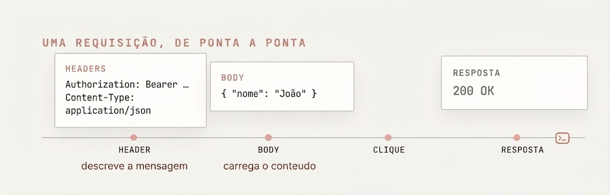
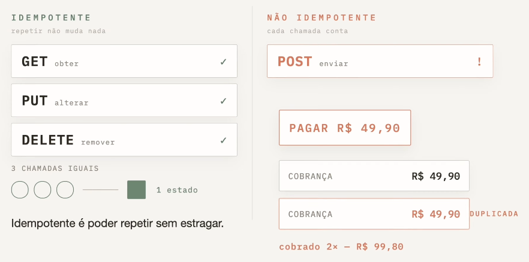
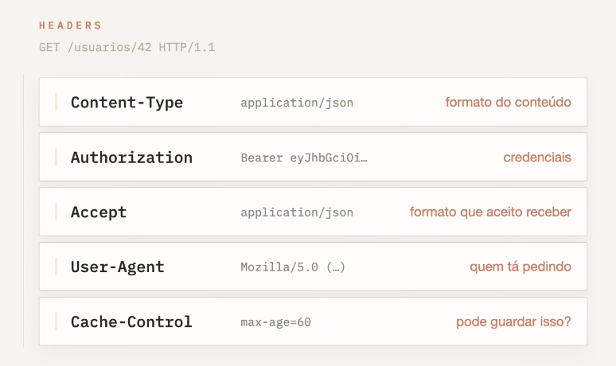
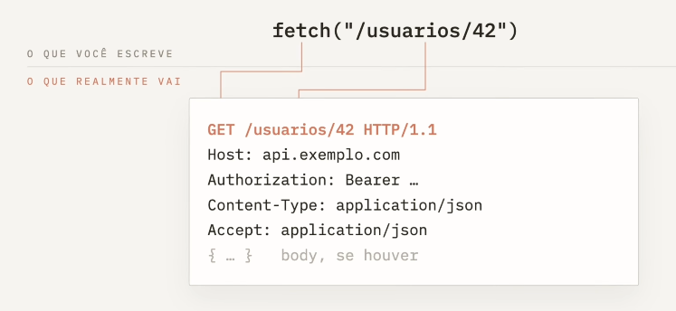

# 🌐 Documentação Interativa do Protocolo HTTP 

<div style="display: flex; flex-direction: column; align-items: center; gap:10px; font-family: sans-serif; align='center' ">
  
  <h2>1. O Ciclo Básico: Cliente e Servidor</h2>
  <p style="text-align: center; max-width: 70%; line-height: 1.6;">
    Toda comunicação na web se baseia no modelo Cliente-Servidor. O navegador (cliente) envia uma requisição e aguarda a resposta do host (servidor) para renderizar a página ou atualizar os dados.
  </p>
  

  <h2>2. Anatomia de uma Requisição</h2>
  <p style="text-align: center; max-width: 70%; line-height: 1.6;">
    Durante esse trajeto, a mensagem possui componentes distintos. Os <strong>Headers</strong> descrevem a requisição (como o tipo de conteúdo), enquanto o <strong>Body</strong> carrega o payload principal, viajando até que o servidor retorne um código de status, como <code>200 OK</code>.
  </p>
  

  <h2>3. Idempotência no Design de APIs</h2>
  <p style="text-align: center; max-width: 70%; line-height: 1.6;">
    No consumo de APIs REST, entender a idempotência é crucial. Métodos como <strong>GET</strong>, <strong>PUT</strong> e <strong>DELETE</strong> são idempotentes: repetir a chamada não altera o estado do servidor além da primeira vez. Já o <strong>POST</strong> não é idempotente; repeti-lo pode causar efeitos colaterais indesejados, como duplicar o processamento de um pagamento.
  </p>
  

  <h2>4. O Papel dos Headers</h2>
  <p style="text-align: center; max-width: 70%; line-height: 1.6;">
    Os cabeçalhos funcionam como os metadados da transação. Eles são responsáveis por passar credenciais de segurança (<code>Authorization</code>), definir os formatos de dados aceitos (<code>Accept</code>) e lidar com o cache, garantindo que o back-end e o front-end "falem a mesma língua".
  </p>
  

  <h2>5. Do Código para a Rede</h2>
  <p style="text-align: center; max-width: 70%; line-height: 1.6;">
    Quando você utiliza funções nativas no front-end, como o <code>fetch()</code> em aplicações Vue.js ou React, muita complexidade é abstraída. O navegador pega sua chamada simples e a converte internamente na estrutura rigorosa do protocolo HTTP/1.1 antes de despachá-la para o servidor.
  </p>
  

</div>

## 🛠️ Endpoints & Métodos HTTP

<details>
<summary>
🟩 <code>GET</code> <code>/api/v1/produtos</code> Quero obter

</summary>

###  🟩 `GET` `/api/v1/produtos`

**Obter Todos os Produtos**

Solicita o envio do recurso especificado do servidor para o cliente . Não altera dados no servidor (método de leitura pura) .

#### 📥 Parâmetros de Consulta (Query Parameters)
*   `limit` *(integer - query)*: Quantidade máxima de itens a retornar (ex: `?limit=5`).
*   `category` *(string - query)*: Filtra os itens por uma categoria específica.

#### 📇 Cabeçalhos da Requisição (Request Headers)
```http
Host: localhost:8000
Accept: application/json
Accept-Language: pt-BR
```
*(Cabeçalhos funcionam como pares de `nome: valor` que fornecem metadados de contexto )*

#### 📤 Resposta Esperada (Response)
**Status**: `200 OK` 
**Response Headers**:
```http
Content-Type: application/json
Content-Length: 138
```

**Response Body**:
```json
[
  {
    "id": 1,
    "nome": "Notebook",
    "preco": 4500.00,
    "quantidade": 10

```

#### 🐍 Implementação em Python
*Cliente (consumindo a API com Requests)* :
```python
import requests

url = "http://localhost:8000/api/v1/produtos"
params = {"limit": 5}
headers = {
    "Accept": "application/json",
    "Accept-Language": "pt-BR"
}

try:
    response = requests.get(url, params=params, headers=headers)
    print(f"Status Code: {response.status_code}")  # Esperado: 200 OK 
    if response.status_code == 200:
        produtos = response.json()
        print("Produtos cadastrados:", produtos)
except requests.exceptions.RequestException as e:
    print(f"Falha ao conectar na API: {e}")
```

*Servidor (Definindo a Rota no FastAPI)*:
```python
from fastapi import FastAPI, Query
from typing import Optional

app = FastAPI()

# Banco de dados simulado (em memória)
PRODUTOS_DB = [
    {"id": 1, "nome": "Notebook", "preco": 4500.00, "quantidade": 10},
    {"id": 2, "nome": "Smartphone", "preco": 2500.00, "quantidade": 

@app.get("/api/v1/produtos", status_code=200)
def listar_produtos(limit: Optional = Query(None, description="Limite de itens")):
    # Retorna o recurso solicitado sob demanda [201,
    return PRODUTOS_DB[:l if limit else PRODUTOS_DB
```

</details>


<details>
<summary>
🟦 <code>POST</code> <code>/api/v1/produtos</code> Quero enviar

</summary>

### 🟦 `POST` `/api/v1/produtos`
**Criar Novo Produto**

Solicita que o servidor aceite a entidade incluída no corpo da requisição para criar um novo recurso sob o caminho especificado [205,.

#### 📥 Corpo da Requisição (Request Body)
**Content-Type**: `application/json` 
```json
{
  "nome": "Teclado Mecânico",
  "preco": 350.00,
  "quantidade": 20
}
```

#### 📤 Resposta Esperada (Response)
**Status**: `201 Created` 
**Response Body**:
```json
{
  "id": 3,
  "nome": "Teclado Mecânico",
  "preco": 350.00,
  "quantidade": 20
}
```

#### 🐍 Implementação em Python
*Cliente (consumindo a API com Requests)* :
```python
import requests

url = "http://localhost:8000/api/v1/produtos"
payload = {
    "nome": "Teclado Mecânico",
    "preco": 350.00,
    "quantidade": 20
}

try:
    response = requests.post(url, json=payload)
    print(f"Status Code: {response.status_code}")  # Esperado: 201 Created 
    if response.status_code == 201:
        print("Produto criado com sucesso:", response.json())
except requests.exceptions.RequestException as e:
    print(f"Erro ao criar produto: {e}")
```

*Servidor (Definindo a Rota no FastAPI)*:
```python
from fastapi import FastAPI, status
from pydantic import BaseModel

app = FastAPI()

class ProdutoSchema(BaseModel):
    nome: str
    preco: float
    quantidade: int

PRODUTOS_DB

@app.post("/api/v1/produtos", status_code=status.HTTP_201_CREATED)
def criar_produto(produto: ProdutoSchema):
    # Simula inserção automática de ID no banco de dados 
    novo_id = len(PRODUTOS_DB) + 1
    novo_produto = {"id": novo_id, **produto.model_dump()}
    PRODUTOS_DB.append(novo_produto)
    return novo_produto
```
</details>

<details>
<summary>
🟨 <code>PUT</code> <code>/api/v1/produtos/{id}</code> Quero alterar

</summary>

### 🟨 `PUT` `/api/v1/produtos/{id}`
**Atualizar Produto Completamente**

Requisita que o recurso correspondente ao `{id}` seja modificado ou completamente substituído pelas informações enviadas no corpo . Se o recurso não existir, o servidor pode criá-lo .

#### 📥 Parâmetros de Caminho (Path Parameters)
*   `id` *(integer - path)*: Identificador único do produto .

#### 📥 Corpo da Requisição (Request Body)
**Content-Type**: `application/json` 
```json
{
  "nome": "Notebook Pro",
  "preco": 5500.00,
  "quantidade": 8
}
```

#### 📤 Resposta Esperada (Response)
**Status**: `200 OK` 
**Response Body**:
```json
{
  "id": 1,
  "nome": "Notebook Pro",
  "preco": 5500.00,
  "quantidade": 8
}
```

#### 🐍 Implementação em Python
*Cliente (consumindo a API com Requests)* :
```python
import requests

produto_id = 1
url = f"http://localhost:8000/api/v1/produtos/{produto_id}"
payload = {
    "nome": "Notebook Pro",
    "preco": 5500.00,
    "quantidade": 8
}

try:
    response = requests.put(url, json=payload)
    print(f"Status Code: {response.status_code}")  # Esperado: 200 OK 
    if response.status_code == 200:
        print("Produto atualizado:", response.json())
except requests.exceptions.RequestException as e:
    print(f"Erro na atualização: {e}")
```

*Servidor (Definindo a Rota no FastAPI)*:
```python
from fastapi import FastAPI, HTTPException
from pydantic import BaseModel

app = FastAPI()

PRODUTOS_DB = [{"id": 1, "nome": "Notebook", "preco": 4500.00, "quantidade":

class ProdutoSchema(BaseModel):
    nome: str
    preco: float
    quantidade: int

@app.put("/api/v1/produtos/{id}", status_code=200)
def atualizar_produto(id: int, produto: ProdutoSchema):
    for idx, item in enumerate(PRODUTOS_DB):
        if item[ == id:
            PRODUTOS_DB = {"id": id, **produto.model_dump()}
            return PRODUTOS_DB
    # Lança erro 404 caso o recurso não exista no banco de dados 
    raise HTTPException(status_code=404, detail="Produto não encontrado")
```
</details>

<details>
<summary>
🟥 <code>DELETE</code> <code>/api/v1/produtos/{id}</code> Quero remover

</summary>

### 🟥 `DELETE` `/api/v1/produtos/{id}`
**Remover um Produto**

Solicita a exclusão do recurso mapeado na URI especificada .

#### 📥 Parâmetros de Caminho (Path Parameters)
*   `id` *(integer - path)*: Identificador único do produto .

#### 📤 Resposta Esperada (Response)
**Status**: `200 OK`  ou `204 No Content` (indica exclusão sem dados adicionais para retornar) [130,.

**Response Body**:
```json
{
  "message": "Produto deletado com sucesso!"
}
```

#### 🐍 Implementação em Python
*Cliente (consumindo a API com Requests)* :
```python
import requests

produto_id = 1
url = f"http://localhost:8000/api/v1/produtos/{produto_id}"

try:
    response = requests.delete(url)
    print(f"Status Code: {response.status_code}")  # Esperado: 200 
    if response.status_code == 200:
        print("Resposta:", response.json())
except requests.exceptions.RequestException as e:
    print(f"Erro ao deletar: {e}")
```

*Servidor (Definindo a Rota no FastAPI)*:
```python
from fastapi import FastAPI, HTTPException

app = FastAPI()

PRODUTOS_DB = [{"id": 1, "nome": "Notebook", "preco": 4500.00, "quantidade":

@app.delete("/api/v1/produtos/{id}", status_code=200)
def deletar_produto(id: int):
    global PRODUTOS_DB
    inicial_len = len(PRODUTOS_DB)
    PRODUTOS_DB = [item for item in PRODUTOS_DB if item[ !
    if len(PRODUTOS_DB) < inicial_len:
        return {"message": "Produto deletado com sucesso!"}
    raise HTTPException(status_code=404, detail="Produto não encontrado")
```
</details>

<details>
<summary>
⬜ <code>HEAD</code> <code>/api/v1/produtos/{id}</code>

</summary>

### ⬜ `HEAD` `/api/v1/produtos`
**Obter Metadados dos Recursos**

Solicita uma resposta idêntica à de uma requisição `GET`, mas sem o corpo da resposta . É altamente útil para testar a existência de arquivos, analisar cabeçalhos ou verificar o tamanho de um recurso grande (`Content-Length`) antes de realizar o download real .

#### 📤 Resposta Esperada (Response)
**Status**: `200 OK` 

**Response Headers**:
```http
Content-Type: application/json
Content-Length: 138
```
*(Nota: O corpo da resposta está vazio, sem tráfego de dados adicionais )*

#### 🐍 Implementação em Python
```python
import requests

url = "http://localhost:8000/api/v1/produtos"

try:
    response = requests.head(url)
    print(f"Status Code: {response.status_code}")  # Esperado: 200 OK 
    print("Cabeçalhos recebidos (Metadata):")
    for k, v in response.headers.items():
        print(f"  {k}: {v}")
    print(f"Tamanho do corpo retornado: {len(response.text)} bytes")  # Sempre 0 
except requests.exceptions.RequestException as e:
    print(f"Erro: {e}")
```
</details>

<details>
<summary>
🟪 <code>OPTIONS</code> <code>/api/v1/produtos/{id}</code>

</summary>

### 🟪 `OPTIONS` `/api/v1/produtos`
**Consultar Métodos Suportados**

Retorna a lista de métodos HTTP que o servidor aceita e suporta para a URI especificada . Frequentemente disparado automaticamente por navegadores como uma consulta "Preflight" para políticas de segurança de compartilhamento de recursos de origens diferentes (CORS) [206,.

#### 📤 Resposta Esperada (Response)
**Status**: `200 OK` 
**Response Headers**:
```http
Allow: GET, POST, OPTIONS, HEAD
Content-Length: 0
```

#### 🐍 Implementação em Python
```python
import requests

url = "http://localhost:8000/api/v1/produtos"

try:
    response = requests.options(url)
    print(f"Status Code: {response.status_code}")  # Esperado: 200 OK 
    # O cabeçalho 'Allow' informa as ações permitidas 
    print("Métodos suportados:", response.headers.get("Allow"))
except requests.exceptions.RequestException as e:
    print(f"Erro: {e}")
```
</details>

## 📋 Códigos de Resposta HTTP (Status Codes)
Toda resposta contém um código de status para indicar o resultado final da solicitação :

| Categoria | Exemplo de Código | Significado Teórico & Prático |
| :--- | :--- | :--- |
| **`2xx` (Sucesso)** | **`200 OK`**  | A requisição foi processada com sucesso absoluto . |
| | **`201 Created`**  | A requisição teve sucesso e um recurso novo foi criado . |
| | **`204 No Content`**  | Sucesso, mas não há corpo de mensagem para retornar (comum em `DELETE`) . |
| **`4xx` (Erro do Cliente)** | **`400 Bad Request`**  | O servidor não conseguiu entender a requisição devido à sintaxe inválida . |
| | **`401 Unauthorized`**  | O cliente precisa se autenticar para obter a resposta solicitada . |
| | **`403 Forbidden`**  | O cliente é conhecido, mas não tem permissões para esse recurso específico . |
| | **`404 Not Found`**  | O recurso solicitado não pôde ser encontrado no servidor . |
| **`5xx` (Erro do Servidor)**| **`500 Internal Server`**  | O servidor encontrou uma situação inesperada que o impediu de processar . |  

<br/>

## 🔍 Anatomia Estruturada de Mensagens HTTP
O tráfego de dados consiste puramente em texto estruturado :

### 1. Linha de Requisição (*Request Line*)
Composta por: `Método` + `URI do Recurso` + `Versão do Protocolo` 
```http
GET /api/v1/produtos HTTP/1.1
```

### 2. Linha de Status (*Status Line*)
Composta por: `Versão do Protocolo` + `Código do Status` + `Texto de Motivo` 
```http
HTTP/1.1 200 OK
```
